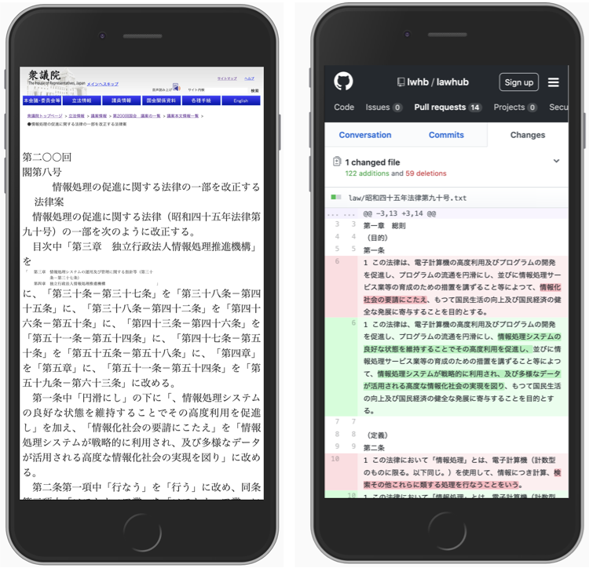

## 議案一覧
現在審議中の議案は[こちら](https://github.com/lwhb/lawhub/pulls?utf8=%E2%9C%93&q=is%3Apr+is%3Aopen+-label%3A%E6%88%90%E7%AB%8B+)。  

#### 回次別

|国会回次|会期|提出|成立|
|:---|:---|:---|:---|
|第201回国会（常会）|2020年1月20日 – | | |
|第200回国会（臨時会）|2019年10月4日 – 2019年12月9日|[提出議案一覧](https://github.com/lwhb/lawhub/pulls?utf8=%E2%9C%93&q=is%3Apr+%22%E7%AC%AC%E4%BA%8C%E3%80%87%E3%80%87%E5%9B%9E%22+in%3Atitle+)|[成立議案一覧](https://github.com/lwhb/lawhub/pulls?utf8=%E2%9C%93&q=is%3Apr+label%3A%E6%88%90%E7%AB%8B+label%3A%E7%AC%AC200%E5%9B%9E+)|
|第199回国会（臨時会）|2019年8月1日 – 2019年8月5日|[提出議案一覧](https://github.com/lwhb/lawhub/pulls?utf8=%E2%9C%93&q=is%3Apr+%22%E7%AC%AC%E4%B8%80%E4%B9%9D%E4%B9%9D%E5%9B%9E%22+in%3Atitle+)|[成立議案一覧](https://github.com/lwhb/lawhub/pulls?utf8=%E2%9C%93&q=is%3Apr+label%3A%E6%88%90%E7%AB%8B+label%3A%E7%AC%AC199%E5%9B%9E+)|
|第198回国会（常会）|2019年1月28日 – 2019年6月26日|[提出議案一覧](https://github.com/lwhb/lawhub/pulls?utf8=%E2%9C%93&q=is%3Apr+%22%E7%AC%AC%E4%B8%80%E4%B9%9D%E5%85%AB%E5%9B%9E%22+in%3Atitle+)|[成立議案一覧](https://github.com/lwhb/lawhub/pulls?utf8=%E2%9C%93&q=is%3Apr+label%3A%E6%88%90%E7%AB%8B+label%3A%E7%AC%AC198%E5%9B%9E+)|

なお、全議案が可視化されている訳ではありません。

## Links
* [衆議院議案一覧](http://www.shugiin.go.jp/internet/itdb_gian.nsf/html/gian/menu.htm)
* [LawHub Twitter](https://twitter.com/lawhubtokyo) 

